# Conversational AI Design Guidance

Azure Bot Service enables you to build intelligent, enterprise-grade bots with complete ownership and control of your data. Begin with a simple Q&A bot or build a sophisticated virtual assistant.

In this Conversational AI UX guidance you'll find what are the best practices to build conversational AI for your bot.

First of all here is list of Components of a conversational AI experience

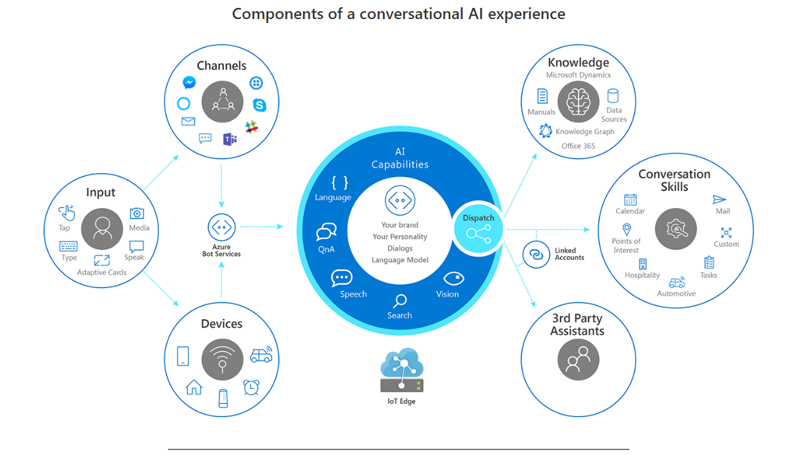

And all necessary info for a Bot's life cycle.

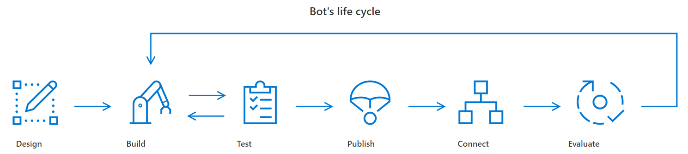

| Design | Build | Test | Publish | Connnect | Evaluate |
|----|---|----|----|----|----|
| <ul><li><a href="https://aka.ms/bot-framework-emulator-design-guidelines">Design guidelines</a></li><li><a href="https://docs.microsoft.com/en-us/azure/bot-service/bot-service-quickstart">Quick start with Azure</a></li><li><a href="https://docs.microsoft.com/en-us/azure/bot-service/dotnet/bot-builder-dotnet-sdk-quickstart">Quick start with .NET SDK</a></li><li><a href="https://docs.microsoft.com/en-us/azure/bot-service/javascript/bot-builder-javascript-quickstart">Quick start with Node.JS</a></li><li><a href="https://docs.microsoft.com/en-us/azure/bot-service/bot-builder-tutorial-basic-deploy">Tutorials</a></li></ul> | <ul><li><a href="https://github.com/Microsoft/BotBuilder-Samples/tree/master/samples/csharp_dotnetcore">C#.NET Samples</a></li><li><a href="https://github.com/Microsoft/BotBuilder-Samples/tree/master/samples/javascript_nodejs">C#.NET Samples</a></li><li><a href="https://azure.microsoft.com/en-us/services/cognitive-services/">Cognitive Services</a></li><li><a href="https://github.com/Microsoft/AI">Solutions </a></li></ul> | <ul><li><a href="https://github.com/Microsoft/BotFramework-Emulator">Test in Emulator</a></li><li><a href="https://github.com/Microsoft/BotFramework-WebChat">Test in Web Chat</a></li></ul> | <ul><li><a href="https://aka.ms/bot-framework-emulator-publish-Azure">Publish directly to Azure</a></li><li><a href="https://aka.ms/bot-framework-emulator-publish-continuous-deployment">Use Continuous Deployment</a></li></ul> | <li><a href="https://aka.ms/bot-framework-emulator-connect-channels">Connect to Channels</a></li> | <li><a href="https://aka.ms/bot-framework-emulator-bot-analytics">View Analytics</a></li> |

> **This document is still under development.**

---

## Contents

- [Welcome Experience](#welcome-experience)
- [Bot Typing Experience](#Bot-Typing-Experience)
- [Prompts](#Prompts)
    - [Text Prompt](#Text-Prompt)
    - [Number Prompt](#Number-Prompt)
    - [DateTime Prompt](#DateTime-Prompt)
    - [Choice Prompt](#Choice-Prompt)
    - [Confirm Prompt](#Confirm-Prompt)
    - [Attachment Prompt](#Attachment-Prompt)
    - [Simple Prompt](#Simple-Prompt)
    - [Multi Prompt](#Multi-Prompt)
    - [Validation Prompt](#Validation-Prompt)
- [Suggested Action](#Suggested-Action)

- [Cards](#Cards)
    - [AdaptiveCard](#AdaptiveCard)
    - [AnimationCard](#AnimationCard)
    - [AudioCard](#AudioCard)
    - [Hero Card](#Hero-Card)
    - [ThumbnailCard](#ThumbnailCard)
    - [RecieptCard](#RecieptCard)
    - [SignInCard](#SignInCard)
    - [VideoCard](#VideoCard)
    - [CardCarousel](#CardCarousel)
    - [Card List](#Card-List)

- [Conversation User Experiences](#Conversation-User-Experiences)
    - [Natural Language Processing](#Natural-Language-Processing)
    - [Question and Answering](#Question-and-Answering)
    - [Search](#Search)
    - [Authentication](#Authentication)
    - [Dialogs](#Dialogs)
        - [Guided Conversation Experience](#Guided-Conversation-Experience)
        - [LUIS + Guided Conversation Experience](#LUIS-+-Guided-Conversation-Experience)
        - [LUIS Experience](#LUIS-Experience)
        - [Nested Conversation Dialogs](#Nested-Conversation-Dialogs)

---

## Welcome Experience

Send a message to your user once they join the conversation. 

| UI Screenshot | Code Samples |
|----|----|
| 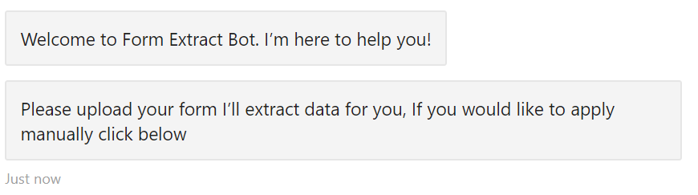 | C# sample: [Welcome Message][3]    JS sample: [Welcome Message][60] |

## Bot Typing Experience

It's always great to give human-like impression, typing experince from bot.

| UI Screenshot | Code Samples |
|----|----|
| 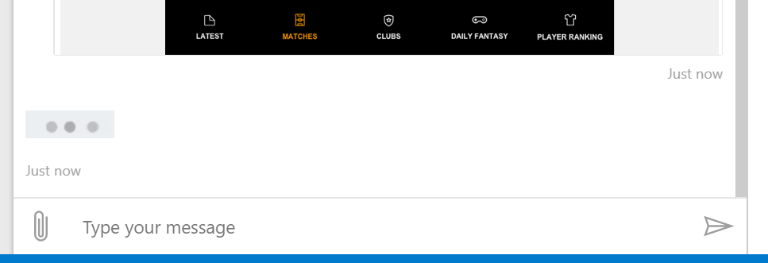 | C# sample: [Send Typing Activity][10] |

---

## Prompts
A conversation between a bot and a user often involves asking (prompting) the user for information, parsing the user's response, and then acting on that information.

Your bot should track the context of a conversation, so that it can manage its behavior and remember answers to previous questions. A bot's state is information it tracks to respond appropriately to incoming messages.

### Text Prompt
Asks for general text input.

| UI Screenshot | Code Samples |
|----|----|
| 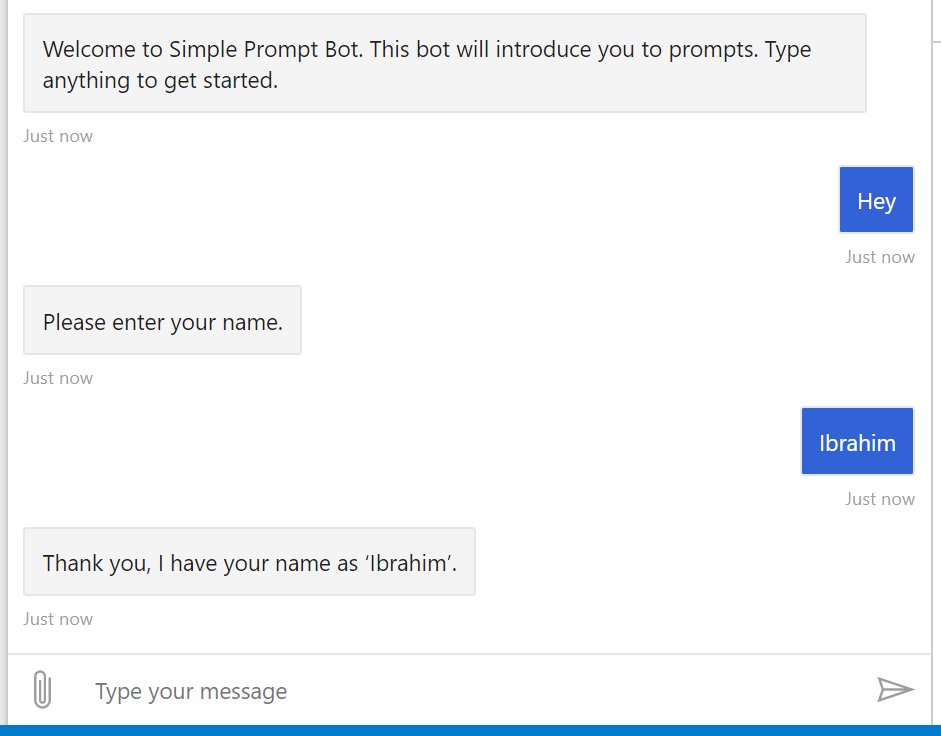 | C# sample: [Simple Prompt][4] |

### Number Prompt
Asks for a number.

| UI Screenshot | Code Samples |
|----|----|
| 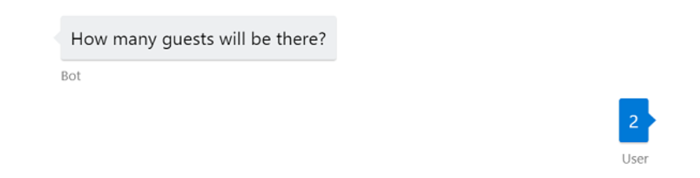 | C# sample:   |

### DateTime Prompt
Asks for a date-time.

| UI Screenshot | Code Samples |
|----|----|
| 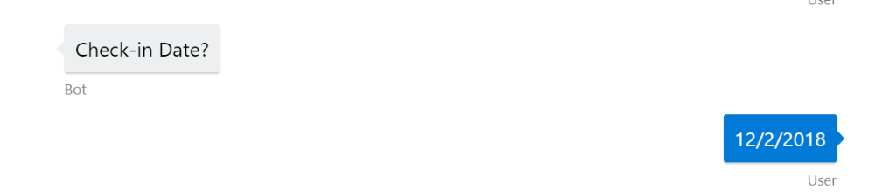 | C# sample:  |

### Choice Prompt
Asks for a choice from a set of options.

| UI Screenshot | Code Samples |
|----|----|
| 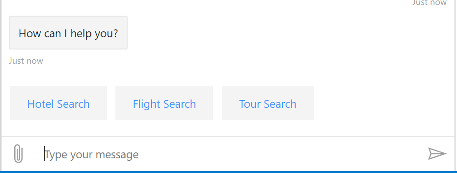 | C# sample: [Digital Travel Assistant][7]|

### Confirm Prompt
Asks for a confirmation.

| UI Screenshot | Code Samples |
|----|----|
| 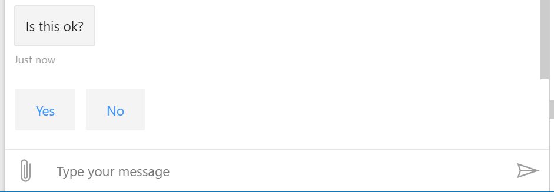 | C# sample: [Multi-Turn Prompt][5] |

### Attachment Prompt
Asks for one or more attachments, such as a document or image.

### Simple Prompt

| UI Screenshot | Code Samples |
|----|----|
|  | C# sample: [Simple Prompt][4] |

### Multi Prompt

| UI Screenshot | Code Samples |
|----|----|
| 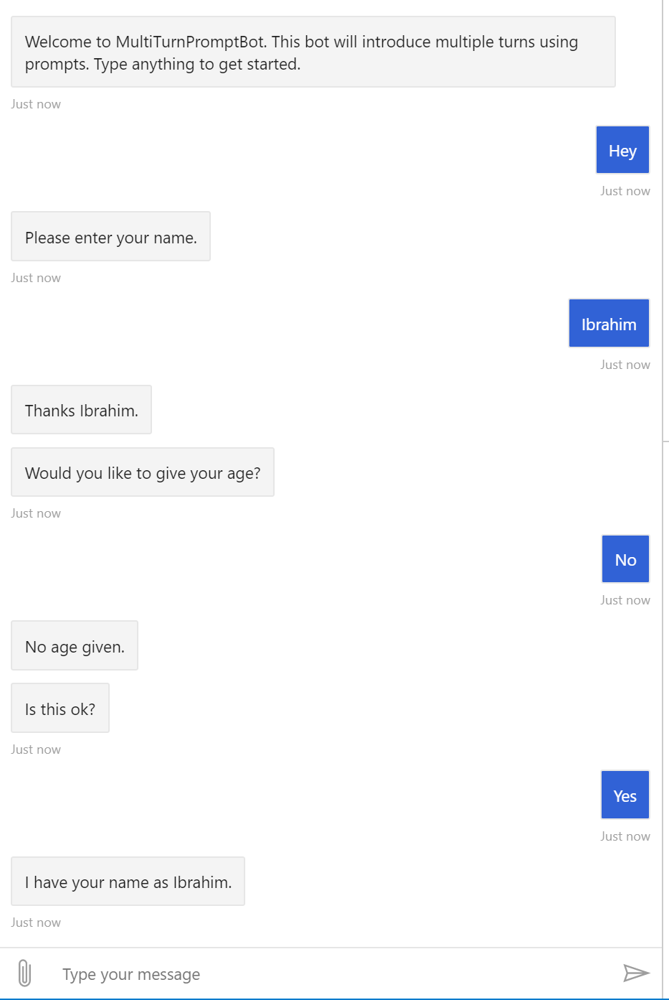 | C# sample: [Multi-Turn Prompt][5] |

### Validation Prompt

| UI Screenshot | Code Samples |
|----|----|
| 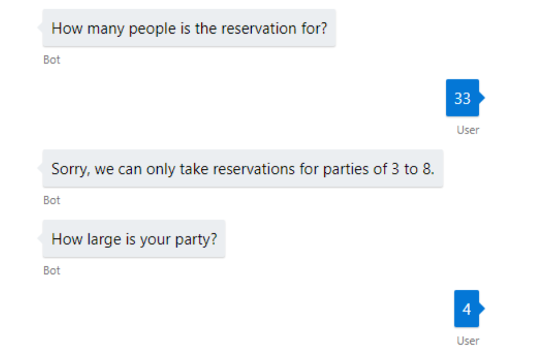 | C# sample: [Validation Prompt][12] |

---

## Suggested Action

| UI Screenshot | Code Samples |
|----|----|
| 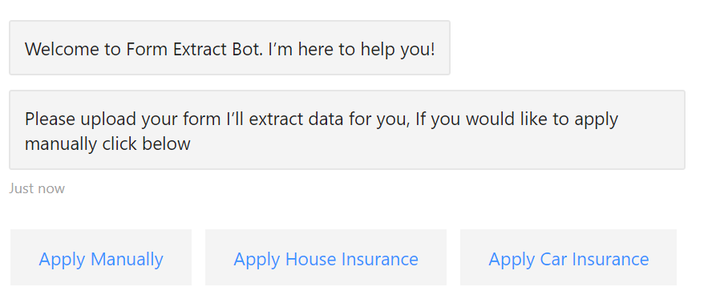 | C# sample: [Suggested Action][6] |

## Cards
### AdaptiveCard
An open card exchange format rendered as a JSON object. Typically used for cross-channel deployment of cards. Cards adapt to the look and feel of each host channel.

| UI Screenshot | Code Samples |
|----|----|
|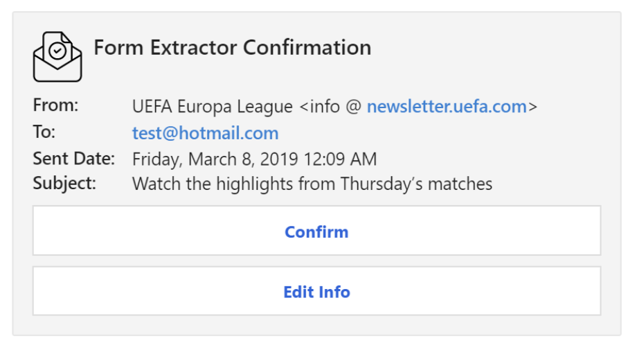 | C# sample: [Using Adaptive Cards][1] |

### AnimationCard
A card that can play animated GIFs or short videos.

| UI Screenshot | Code Samples |
|----|----|
| 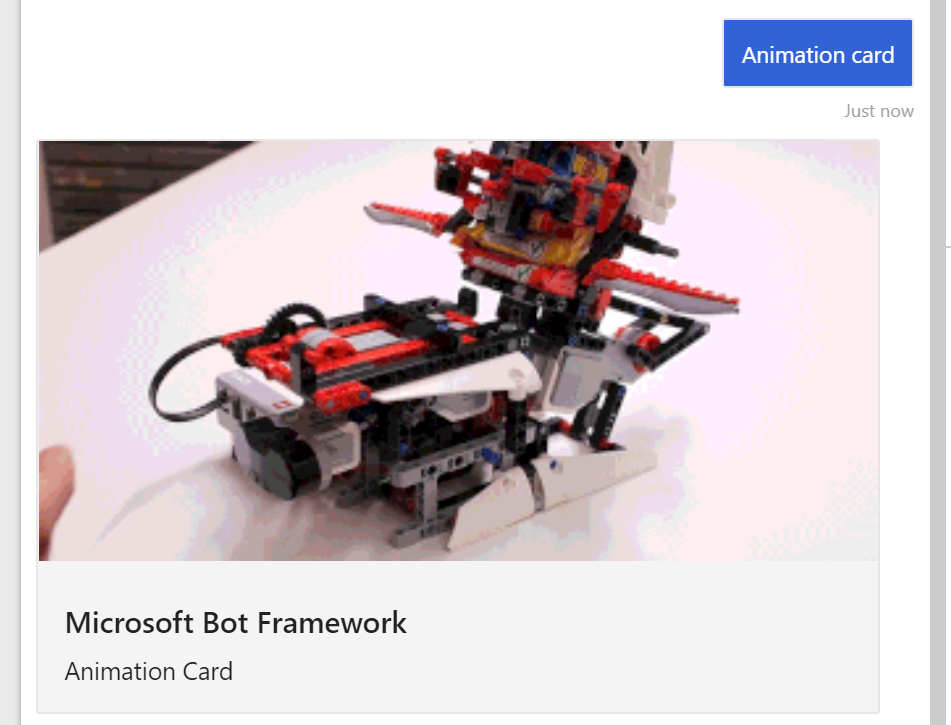 | C# sample: [Using Cards][2] |

### AudioCard

| UI Screenshot | Code Samples |
|----|----|
| 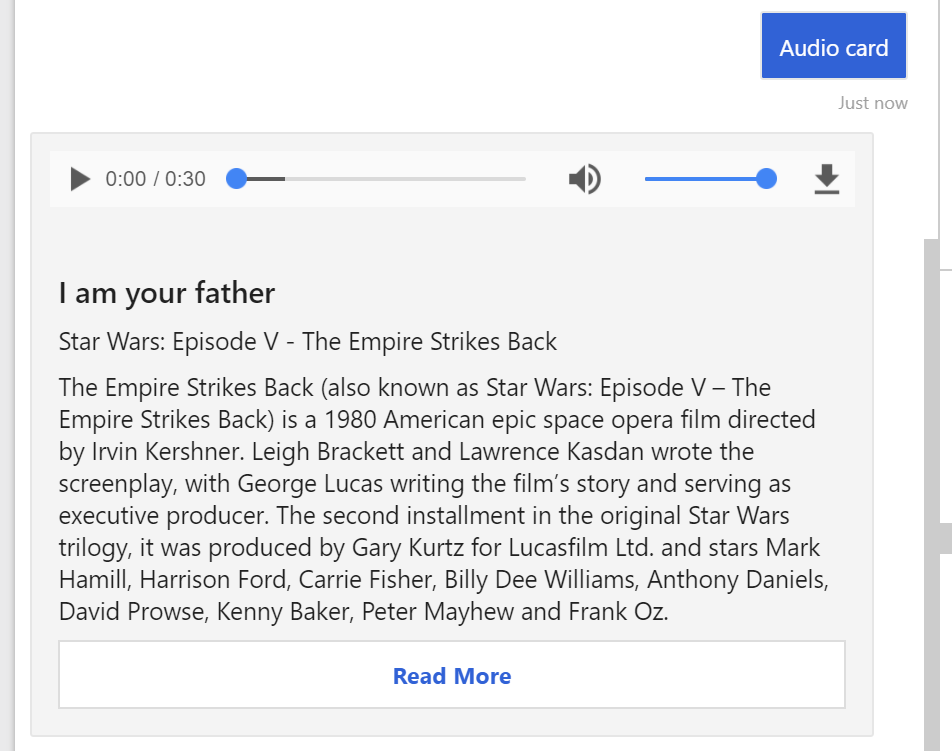 | C# sample: [Using Cards][2] |

### Hero Card

| UI Screenshot | Code Samples |
|----|----|
|  | C# sample: [Using Cards][2]   Code Snippet: [HeroCard][41] |

### ThumbnailCard

| UI Screenshot | Code Samples |
|----|----|
|  | C# sample: [Using Cards][2]   Code Snippet: [ThumbnailCard][40] |

### RecieptCard

| UI Screenshot | Code Samples |
|----|----|
| 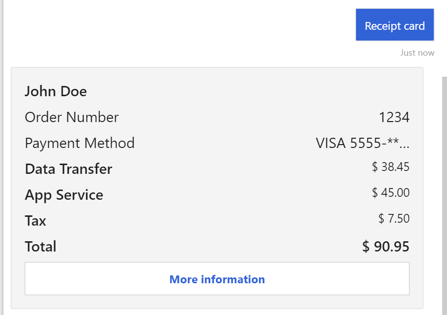 | C# sample: [Using Cards][2] |

### SignInCard

| UI Screenshot | Code Samples |
|----|----|
| 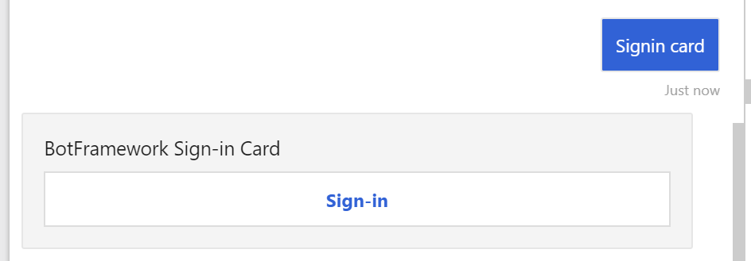 | C# sample: [Using Cards][2] |

### VideoCard

| UI Screenshot | Code Samples |
|----|----|
| 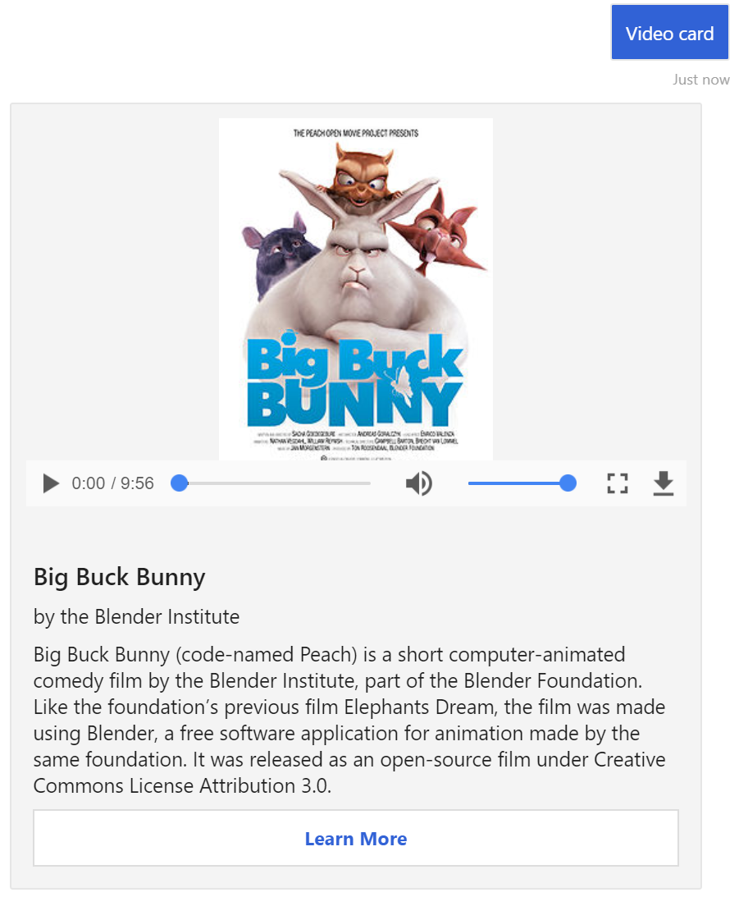 | C# sample: [Using Cards][2] |

### CardCarousel

| UI Screenshot | Code Samples |
|----|----|
| 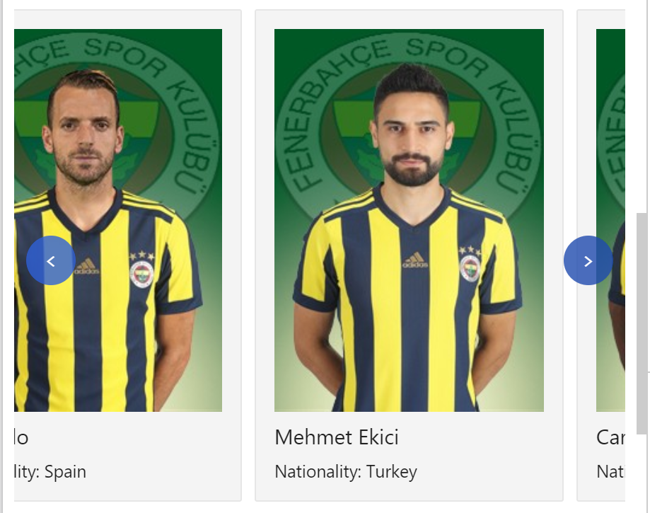 | C# sample: [Using Cards][2] |

### Card List

| UI Screenshot | Code Samples |
|----|----|
| 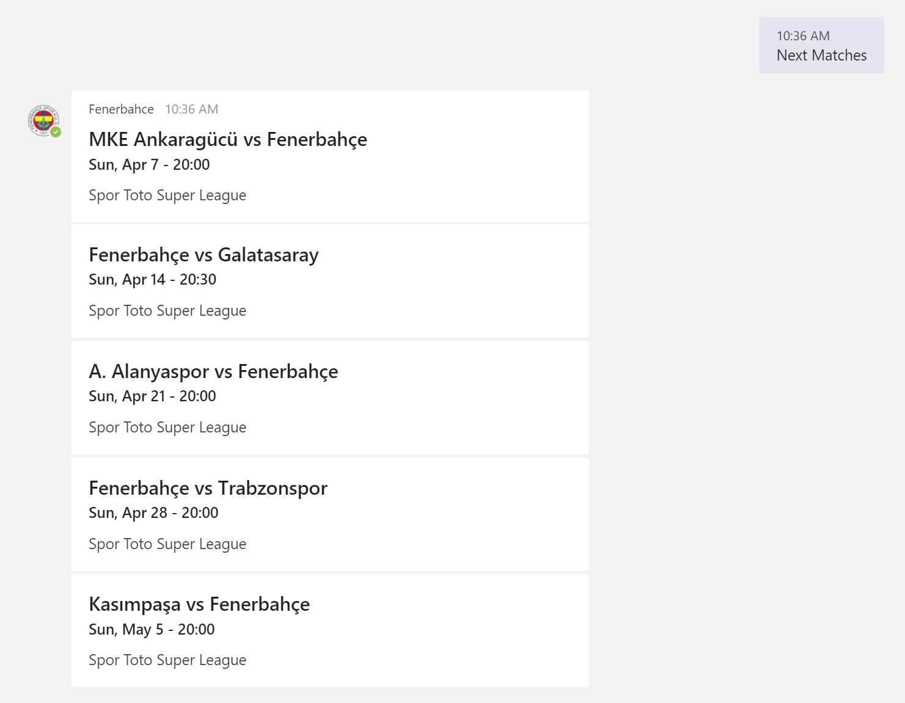 | C# sample: [Using Cards][2] |

---

# Conversation User Experiences

## Natural Language Processing

Designed to identify valuable information in conversations, LUIS interprets user goals (intents) and distills valuable information from sentences (entities), for a high quality, nuanced language model. LUIS integrates seamlessly with the Azure Bot Service, making it easy to create a sophisticated bot.

---

## Question and Answering

Build, train and publish a simple question and answer bot based on FAQ URLs, structured documents, product manuals or editorial content in minutes.

---

## Search

Azure Search is a search-as-a-service cloud solution that gives developers APIs and tools for adding a rich search experience over private, heterogenous content in web, mobile, and enterprise applications. Query execution is over a user-defined index.

Search Experience  | Code Sample|
:-------------------------:|:-----------:|
  | C# sample: [Azure Search with Bot Framework][13]

---

## Authentication

New bot authentication capabilities in Azure Bot Service, providing features to make it easier to develop a bot that authenticates users to various identity providers such as Azure AD (Azure Active Directory), GitHub, Uber, and so on. These updates also take steps towards an improved user experience by eliminating the magic code verification for some clients.

| UI Screenshot | Code Samples |
|----|----|
|  | C# sample: [Bot Authentication][14] |

---

## Dialogs
Dialogs are a central concept in the SDK, and provide a useful way to manage a conversation with the user. Dialogs are structures in your bot that act like functions in your bot's program; each dialog is designed to perform a specific task, in a specific order. You can specify the order of individual dialogs to guide the conversation, and invoke them in different ways - sometimes in response to a user, sometimes in response to some outside stimuli, or from other dialogs.

## Guided Conversation Experience

Guided Conversation | Code Sample|
:-------------------------:|:-----------:|
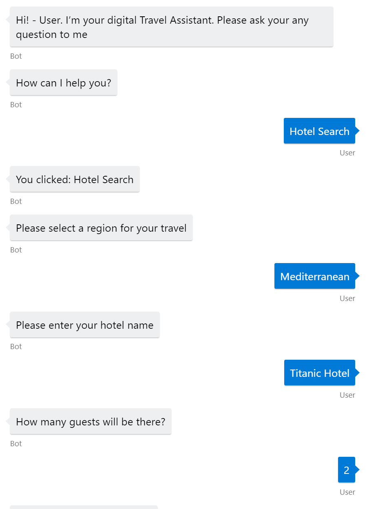  | C# sample: [Digital Travel Assistant][7]

## LUIS + Guided Conversation Experience

Guided Conversation | Code Sample|
:-------------------------:|:-----------:|
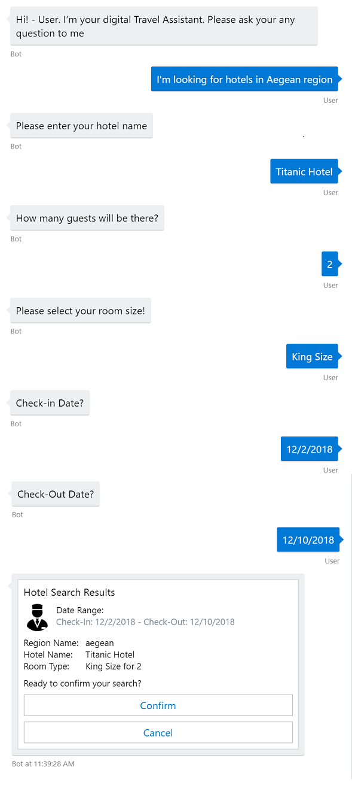  | C# sample: [Digital Travel Assistant][7]

## LUIS Experience

Dynamic Conversations with multiple inputs managed in WaterFall Dialogs to provide only needed prompts to retrieve information.
On the left side , a question including "number of guests", "Region" , "Check-in Date" and "Check-out Date", then agent asks only needed questions. 
On the right side, the question includes only "number of guests" and "Region" and then agent ask questions to complete them.

 LUIS with 4 entities             |  LUIS with 2 entities | Code Sample|
:-------------------------:|:-------------------------:|:-----------:|
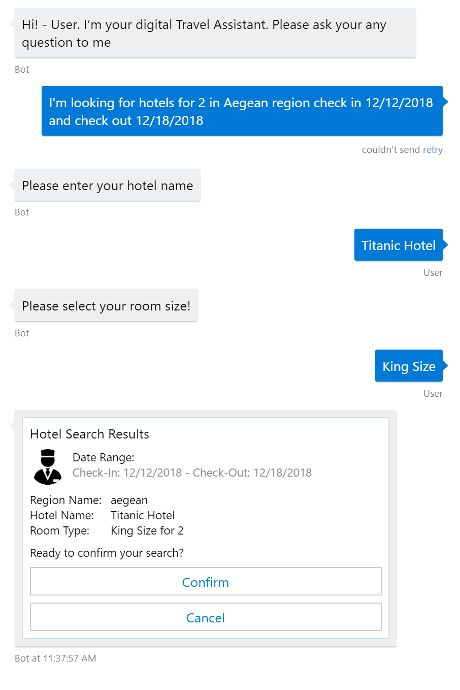  |  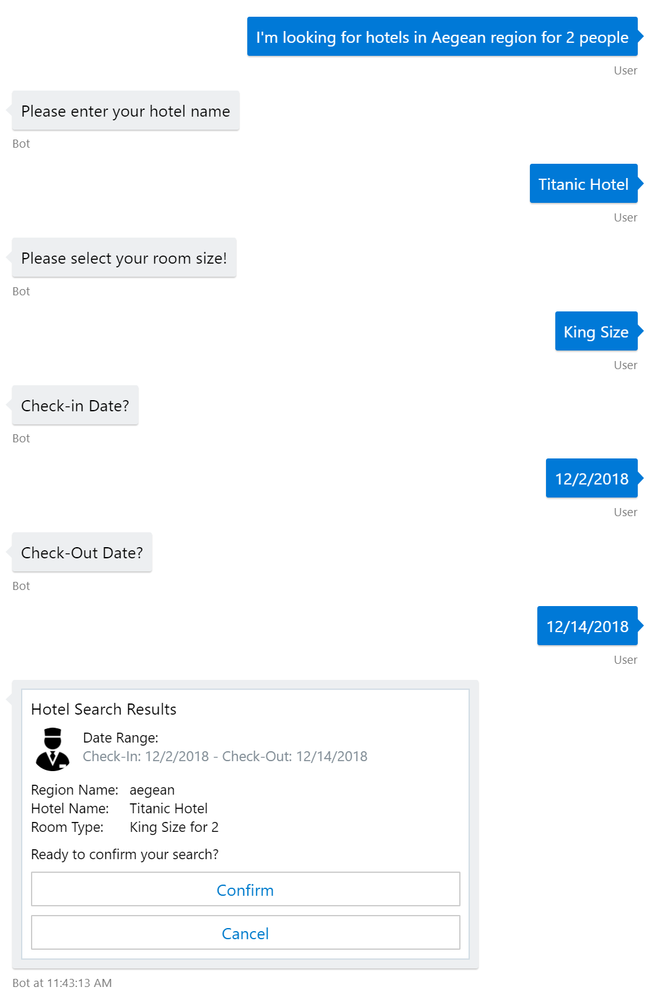 | C# sample: [Digital Travel Assistant][7]

## Nested Conversation Dialogs

Nested Conversation Dialogs | Code Sample|
-------------------------|-----------|
  | C# sample: [MenuBot C#][8]   JS sample: [MenuBot JS][9]

Enjoy.

[1]: https://github.com/Microsoft/BotBuilder-Samples/tree/master/samples/csharp_dotnetcore/07.using-adaptive-cards
[2]: https://github.com/Microsoft/BotBuilder-Samples/tree/master/samples/csharp_dotnetcore/06.using-cards
[3]: https://github.com/Microsoft/BotBuilder-Samples/blob/master/samples/csharp_dotnetcore/03.welcome-user
[4]: https://github.com/Microsoft/BotBuilder-Samples/blob/master/samples/csharp_dotnetcore/04.simple-prompt
[5]: https://github.com/Microsoft/BotBuilder-Samples/blob/master/samples/csharp_dotnetcore/05.multi-turn-prompt
[6]: https://github.com/Microsoft/BotBuilder-Samples/blob/master/samples/csharp_dotnetcore/08.suggested-actions
[7]: https://github.com/ikivanc/Digital-Travel-Assistant
[8]: https://github.com/ikivanc/menu-bot/tree/master/csharp_dotnetcore
[9]: https://github.com/ikivanc/menu-bot/tree/master/javascript_nodejs
[10]: https://gist.github.com/ikivanc/697d6c38871819b8b31e4bbc481f24c9
[11]: https://github.com/Microsoft/BotBuilder-Samples/tree/master/samples/csharp_dotnetcore/10.prompt-validations
[12]: https://docs.microsoft.com/en-us/azure/bot-service/bot-builder-prompts?view=azure-bot-service-4.0&tabs=csharp#custom-validation
[13]: https://github.com/ikivanc/Bot-Framework-v4-with-Azure-Search/
[14]: https://github.com/Microsoft/BotBuilder-Samples/tree/master/samples/csharp_dotnetcore/18.bot-authentication
[40]: https://gist.github.com/ikivanc/0d10161bb0fccaa601b89adcaf86beb6
[41]: https://gist.github.com/ikivanc/dbad21d4266b9b735e48b1410052dd14
[60]: https://github.com/Microsoft/BotBuilder-Samples/blob/master/samples/javascript_nodejs/03.welcome-users